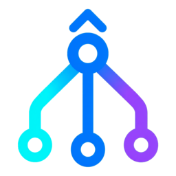
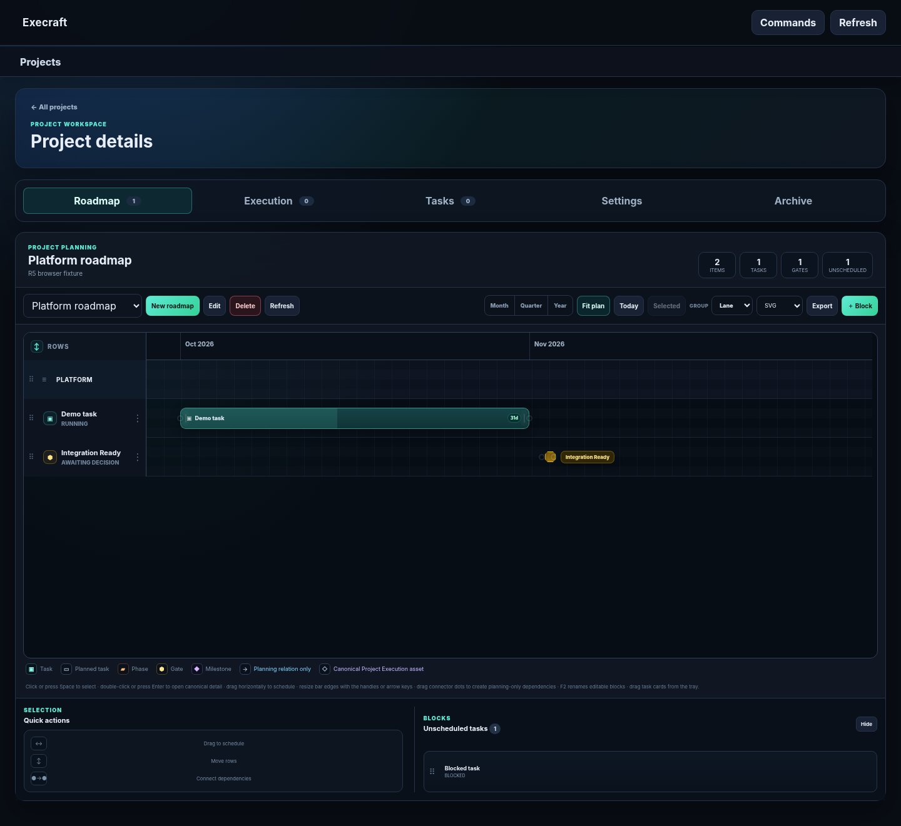
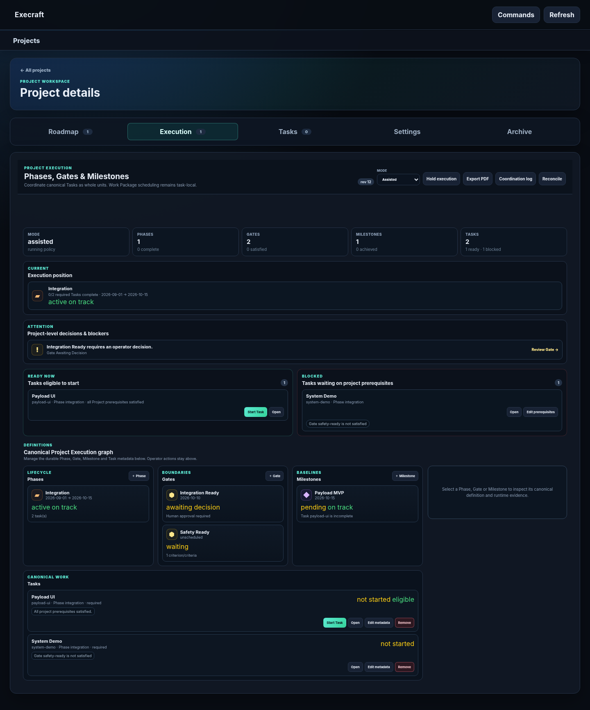
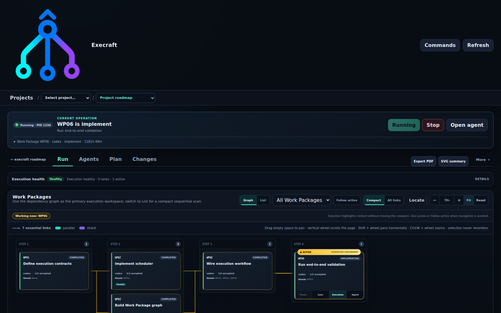

<p align="center">
  
</p>

<h1 align="center">Execraft</h1>

<p align="center">
  <strong>A deterministic engineering execution control plane for humans and AI agents.</strong><br>
  Coordinate AI coding agents across one or more Git repositories without giving up
  ownership of planning, scope, verification, review, commits, recovery, or project state.
</p>

<p align="center">
  <a href="https://github.com/graiola/execraft/actions/workflows/ci.yml"></a>
  <a href="https://github.com/graiola/execraft/actions/workflows/gui-browser.yml"></a>
  <a href="https://github.com/graiola/execraft/releases"></a>
  
  <a href="LICENSE"></a>
</p>

---

## What is Execraft?

**Execraft** sits between your software project and the AI tools that work on it. Agents can
plan, implement, review, and verify changes, while **Execraft** keeps the durable control
state and enforces the rules around what may run, what may change, and when work is
complete.

It is designed for projects where an AI coding assistant is useful, but an opaque
"agent loop" is not enough.

### Highlights

- **Project-aware orchestration** — Roadmaps, Phases, Gates, Milestones, Tasks, and Work Packages have separate, explicit responsibilities.
- **Multi-repository work** — one Task can coordinate controlled changes across several Git repositories.
- **Deterministic safety boundaries** — scope checks, verification, review, commit ownership, recovery, and lifecycle transitions stay under Execraft control.
- **Multiple execution backends** — Native execution is the default; additional runtimes and model routes are exposed through documented extension boundaries.
- **Crash-safe state** — durable journals, intents, optimistic revisions, and reconciliation protect long-running work from process restarts and partial operations.
- **Operator-first GUI** — inspect plans, Roadmaps, Project Execution, agents, evidence, changes, and recovery state from the local web interface.
- **Portable project configuration** — host-specific paths and credentials stay outside portable project descriptors.

## Interface

<table>
  <tr>
    <td width="50%" valign="top">
      <strong>Roadmap planning</strong><br><br>
      
    </td>
    <td width="50%" valign="top">
      <strong>Project Execution</strong><br><br>
      
    </td>
  </tr>
  <tr>
    <td colspan="2" valign="top">
      <strong>Task execution graph</strong><br><br>
      
    </td>
  </tr>
</table>

The Roadmap is a planning/view surface. Project Execution owns canonical project-level
Phases, Gates, Milestones, and Task eligibility. Task execution remains responsible for
Work Packages and agents. Keeping those layers separate is a core architectural rule.

## Quick start

### 1. Install

From a release wheel:

```bash
uv tool install ./execraft-0.1.0-py3-none-any.whl
# or
pipx install ./execraft-0.1.0-py3-none-any.whl
```

The public distribution and CLI command are both **`execraft`**.

Once PyPI trusted publishing is enabled for this repository, the equivalent install is:

```bash
uv tool install execraft
# or
pipx install execraft
```

Python 3.10+ and Git are required.

### 2. Start from an existing Git repository

```bash
cd /path/to/project
execraft start "Add rate limiting to the public API"
```

`execraft start` previews the operation, requests one confirmation, and then creates or
reuses the project registration, Task dossier, isolated workspace, and validated plan.
The preview itself does not invoke an execution agent.

Useful variants:

```bash
# Side-effect-free preview
execraft start "Add rate limiting" --dry-run --json

# Deterministic local planning
execraft start "Add rate limiting" --planner local

# Require agent-backed planning
execraft start "Add rate limiting" --planner agent --require-agent

# Limit optional repository scope
execraft start "Update the login flow" --repositories backend frontend

# Import an existing reviewed plan
execraft start --plan-file ./PLAN.md --planner local
```

### 3. Open the GUI

```bash
execraft gui
```

For the complete workflow, see the **[Operator guide](docs/guide.md)**.

## Mental model

```text
Project
  ├── Roadmap                 planning / visualization
  ├── Project Execution      Phases / Gates / Milestones / Task eligibility
  └── Task
       ├── BRIEF.md
       ├── PLAN.md
       ├── PLAN.graph.yaml
       └── isolated Workspace
             └── Work Packages
                  └── execution agents / runtimes
```

`PLAN.md` is the human-readable plan. `PLAN.graph.yaml` is the validated execution
contract. The orchestrator owns Work Package state transitions; agent/runtime output is
evidence and proposed work, not authority to bypass the control plane.

## Common commands

### Inspect and onboard a project

```bash
execraft project inspect
execraft init --dry-run
execraft init --template standard
execraft project validate <project-id>
execraft project doctor <project-id>
```

### Work with Tasks and workspaces

```bash
execraft task new feature_auth \
  --project sample \
  --title "Add authentication" \
  --brief "Add token-based authentication." \
  --repositories backend frontend

execraft workspace start feature_auth \
  --workspace-root ~/workspace/ai-workspaces/feature_auth \
  --policy workspace-write

execraft workspace status feature_auth
execraft workspace verify feature_auth --profile focused
```

### Inspect orchestration

```bash
execraft orchestrate status --project sample --task-id feature_auth
execraft orchestrate explain --project sample --task-id feature_auth
execraft orchestrate trace --project sample --task-id feature_auth --limit 20
```

### Export presentation artifacts

```bash
execraft export roadmap --project sample --roadmap platform-2026 --format svg --theme dark
execraft export task --project sample --task feature_auth --format pdf
```

## Safety model

Important fail-closed boundaries include:

- project discovery does not execute target source code;
- generated workspaces are Task-owned and isolated from product checkouts;
- verification must be explicitly configured;
- write scope is checked before mutation;
- protected and cross-repository changes require policy approval;
- execution agents do not own commits, branch transitions, or orchestration state;
- runtime/model/target health and support policy remain authoritative;
- secrets and credential references are not projected into browser presentation DTOs;
- completion preserves durable evidence before cleanup.

Read **[Architectural invariants](docs/architectural-invariants.md)** and
**[Workspace lifecycle safety](docs/workspace-lifecycle-safety.md)** before enabling
more autonomous execution policies.

## Documentation

Start with:

- **[Documentation index](docs/README.md)** — complete maintained documentation map.
- **[Operator guide](docs/guide.md)** — end-to-end usage.
- **[Project Execution](docs/project-execution.md)** — project-level control model.
- **[GUI workbench](docs/gui-workbench.md)** — operator interface behavior.
- **[Supported runtime architecture](docs/supported-runtime-architecture.md)** — runtime and extension boundary.
- **[Quality checks](docs/quality-checks.md)** — executable validation contract.
- **[Deployment and releases](docs/deployment.md)** — packaging and public release process.

## Development

```bash
git clone https://github.com/graiola/execraft.git
cd execraft
python3 -m venv .venv
source .venv/bin/activate
python -m pip install -e '.[test,quality]'
python tools/preflight.py
```

The complete release matrix additionally runs typing, the non-browser suite,
JavaScript syntax checks, Chromium journeys, and package build/install validation. See
**[CI and maintenance](docs/ci-and-maintenance.md)**.

Contributions are welcome. Read **[CONTRIBUTING.md](CONTRIBUTING.md)** before opening a
pull request. Security reports should follow **[SECURITY.md](SECURITY.md)** rather than
being filed as public issues.

## Releases

Release artifacts are built from `vX.Y.Z` tags and published on the
**[GitHub Releases](https://github.com/graiola/execraft/releases)** page. The release
workflow verifies that the tag matches `pyproject.toml`, builds wheel/source archives,
checksums them, installs the wheel in a clean environment, and smoke-tests the CLI.

See **[CHANGELOG.md](CHANGELOG.md)** for release notes.

## Author

**Gennaro Raiola** — [gennaro.raiola@gmail.com](mailto:gennaro.raiola@gmail.com)

## License

Released under the **MIT License**. See [LICENSE](LICENSE).

Copyright © 2026 Gennaro Raiola.
